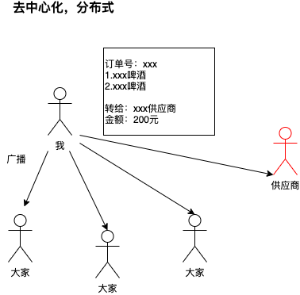
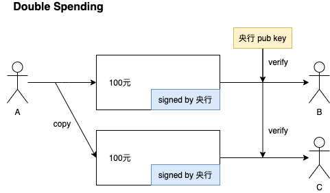
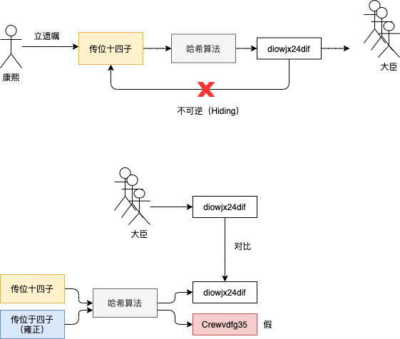
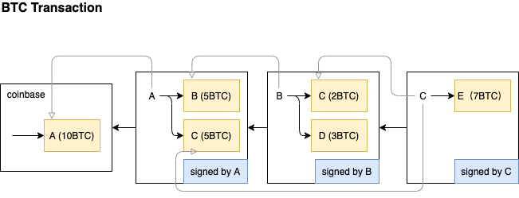
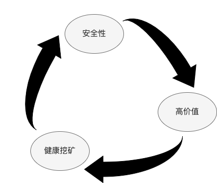

### 一、什么是比特币？

> A purely peer-to-peer version of electronic cash would allow online payments to be sent directly from one party to another without going through a financial institution. 
>
>一个纯正的点对点去中心化的加密数字货币，应能够通过在线支付将币从一方直接发送到另一方，而无需通过任何中心金融机构。

比特币是一种加密货币（crypto-currency），实现自一个自称中本聪（Satoshi Nakamoto）的不明身份的人所发表的一篇论文（[比特币白皮书](https://btcpapers.com/)）

与其说比特币是一种加密货币，不如说比特币是一种基于 P2P 网络的支付结算系统，这样更易于大家理解其本质。

### 二、为什么要发明比特币？

#### 2.1、中心化，基于信任模型

> 酒花 App 平台买了两瓶精酿啤酒
> 一个自称三方供应商的人加我微信，告知我其中一瓶酒没货了，可以加钱换其他的酒
> 虽然这个人微信朋友圈都是精酿啤酒相关的内容，且明确知道我买的哪个酒没货了
> 但是，我内心还是不信任这个人，更信任平台，于是我还是在平台换了一瓶酒

平台就真的值得信任么？
假如我下单的时候正好赶上平台服务器宕机，扣款成功了，但没收到货。由于平台系统做的不好，再也找不到那笔订单，不能证明我付过钱，也不能给我发货。
这笔交易就没有人能说的清楚了，信任也就不存在了。

**比特币要去解决信任问题**

>What is needed is an electronic payment system based on cryptographic proof instead of trust, allowing any two willing parties to transact directly with each other without the need for a trusted third party. 
>
>我们真正需要的是一种基于加密算法密码学原理而非基于信任的数字货币支付系统，不需要可信任第三方参与的情况下，允许双方直接进行支付交易

#### 2.2、双花攻击（Double Spending Attack)

「双花」即同一笔钱花了两次或多次。

假设央行发行了一款数字货币，货币在软件中其实就是文件，完全可以复制。
假如 A 在转给 B 100 元后，又复制了同一笔钱转给了 C，就是所谓的「双花」，双花攻击只通过验证数字货币的签名是不够的，还需要使用额外的手段。

**比特币要去解决双花问题**

> We propose a solution to the double-spending problem using a peer-to-peer network
> 
>我们将在本文提出一种新方案，使用点对点去中心化网络去解决这个双花问题

在**比特币交易**小节中，会详细解释比特币是如何解决双花问题的。

### 三、比特币中的密码学

#### 3.1、哈希算法（Hash Algorithm)

哈希算法是用来做什么的呢？我们先来看一个小故事。

**雍正到底是不是篡位登基的？**

一直有一个传说称雍正不是康熙真正传位的皇帝，而是有人偷偷修改了遗诏，篡位登基的。  

**假如康熙知道哈希函数**  

如果没有哈希函数，在康熙皇帝驾崩后，遗诏是死无对证，只能遗诏写什么，大臣就做什么。

但有了哈希函数后就变得不一样了，康熙可以在活着的时候就可以提前写好遗诏，并用哈希函数计算出一个哈希串，交予大臣们。
大臣们看到哈希串也不能猜出遗诏的内容到底是什么，只能等到遗诏公布的那天，再去计算一次哈希值，看与当初皇帝给的哈希串是否一致，来判断遗诏是否被人篡改了。
如果修改了，就不会遵诏行事。

通过这个小故事，可以简单总结出哈希的两个性质：

1. 防篡改，输入稍有改动，输出千差万别
2. 输出结果不可逆，只知道结果不能反推出输入是什么

#### 3.2、比特币使用的哈希算法

SHA256（Security Hash Algorithm），是一种密码哈希函数（Cryptographic Hash Function）。

$任意输入 ==> SHA256 ==> 256位哈希$

在比特币中，利用了SHA256的三个性质
- 不可逆（Hiding）
- 抗哈希碰撞（Collision resistance）
- 哈希值不可预测（Puzzle friendly）

##### 3.2.1、不可逆（Hiding）

SHA256的特性：
1. 输入长度任意
2. 输出长度固定，256bit

比如

$全世界的图书 ==> SHA256 ==> 256 位哈希$

如果这个过程可逆的话，我们就发现了一种无敌的压缩算法，可以把全世界的图书压成 256 位，再进行存储。

##### 3.2.2、抗哈希碰撞（Collision resistance）

根据[抽屉原理](https://baike.baidu.com/item/%E6%8A%BD%E5%B1%89%E5%8E%9F%E7%90%86/233776)，输入空间无限，输出空间有限，理论上一定会存在碰撞。

但是，从长期经验看，没有什么人为的、高效的方式制造碰撞。

只能通过暴力遍历输入空间的方式来寻找碰撞

##### 3.2.3、哈希值不可预测（Puzzle friendly）

Puzzle Friendly，直译为谜题友好性，是指事先给定一个哈希串，比如 00000000feacb46d... ，前 8 位都是 0，让你解谜题找到输入是什么。

由于 SHA256 没有直接办法或通过找到一定规律来猜出输入是什么，只能通过暴力遍历输入空间的方式来找到答案。（其实一点都不友好）

比如你找到一个输入 a，输出的前 7 位都是 0，感觉再简单调整一下输入就能找到答案了，其实不是的，修改输入后可能得到的答案一个 0 都没有。也就是说你的每一次计算是无记忆性的（Memoryless），只能通过大量地尝试，不断的寻找答案。

除此之外，找到答案后，其他人验证答案却很简单，只需要把你的答案再用哈希函数计算一次即可。（difficult to solve, but easy to verify）

比特币**挖矿过程**充分利用了 Puzzle friendly，后面我们会详细说明。

#### 3.3、数字签名（Digital Signature）

了解数字签名之前，需要先对非对称加密有一定认识。

##### 3.3.1、什么是非对称加密？

Alice 想通过非对称加密的方式发送一条消息给 Bob，他要怎么做呢？

1. Bob 需要先生成公钥私钥对（public key, private key）
2. Bob 的公钥是对所有人公开的，所以 Alice 可以拿到 Bob's public key
3. Alice 使用 Bob's public key 对 Message 加密，并将密文通过网络传输给 Bob
4. Bob 接收到密文后，使用自己的私钥 Bob's private key 解密，得到了 Message
5. 完成通信

由于 Bob's private key 是保存在 Bob 手里的，只要私钥不泄露，就是安全的。

##### 3.3.2、什么是数字签名？

还是 Alice 想要给 Bob 发送一条消息，并采用非对称加密的方式，Alice 凭什么相信 Bob 的公钥就是 Bob 的呢？有没有可能被其他人调包了呢？这就需要 Alice 用到数字签名的技术，来验证 Bob 的身份是否真实

1. Bob 用私钥生成数字签名
2. Alice 用 Bob 的公钥验证签名
3. 如果验证通过，则证明公钥一定是 Bob 的，因为签名只能由 Bob 的私钥生成

### 四、比特币是如何交易的？

#### 4.1、区块链

在比特币系统中，交易是存在区块里的，那么区块链到底是什么呢？

- 一个区块是由 block header 和 block body 组成
- block header 中会存储前一个区块头的哈希值
- block body 中会存储具体的交易信息（Transaction 简写为 Tx)

区块链其实不是区块组成的链表结构，而是通过 (key,value) 数据库实现的。在数据库中，key 是区块头的哈希值，value 是区块内容。

#### 4.2、账户

在比特币中，账户就是由本机生成的公私钥对
- 公钥的哈希值用作转账地址，相当于银行卡号
- 私钥相当于银行密码，需要自己妥善保管，一旦丢失是无法找回的

#### 4.3、防止双花

现实中，A -> B 100元人民币的过程实际是 A 的钱包减少 100元，B 的钱包增加 100元，天然能防止「双花」（除非你把花出去的钱偷回来再花一次）。

但是，比特币中没有账户系统，不会帮你记录用户的账户中余额还有多少。
那么，比特币是如何验证「双花」的呢？

##### 4.3.1、回溯币源

比特币的每笔交易由**未花费的输出（UTXO Unspenting Transaction Output），本次交易的输入**拼接而成。每笔交易会去验证 UTXO 是否能支付足量的币，具体可以看下面的例子。

1. coinbase 称作「铸币」交易，是矿工挖出新区块获得的出块奖励，假设是 A 获得了出块奖励的 10 BTC
2. A 转给了 B 5 BTC，同时转给了 C 5 BTC，这时系统会去验证 A 有没有能力支付 10 BTC，会向前回溯找到 A BTC 的来源，于是找到了铸币交易，发现有 10 BTC，交易合法
3. 同理 C 在转给 E 7BTC 时，需要找到之前交易中得到的 5 + 2 BTC

转账者除了要证明币源，还需要将交易用自己的私钥签名，用于身份验证。

### 五、比特币挖矿

#### 5.1、为什么要挖矿？

1. **产生比特币**，只有挖出新的区块，才会产生新的比特币。中本聪规定，最初出块奖励为 50 BTC，每隔 4 年出块奖励减半，所以比特币总量大概为 2100 万个
2. **打包交易**，通过挖出新区块，打包记录新产生的交易
3. **达成共识**，通过工作量证明（Proof of Work）+ 奖励机制，让系统中的节点达成共识，向好的方向发展

#### 5.2、挖矿的过程

>比特币挖矿的过程和实际挖金矿的过程很像：
>- 金子的总量是有限的，越挖会越少，比特币也是如此
>- 挖金子需要付出科技成本和体力劳动后才能得到回报，比特币也是需要付出算力、电力成本，才能收获比特币

下面我们来简单了解一下，比特币挖矿的过程是怎样的。

##### 5.2.1、找到最长合法链

在比特币中的矿工指的是系统中的全节点，除了挖矿，还要负责维护全量的区块数据

诚实的矿工会按照最长合法链规则挖矿
- **最长**，顾名思义，矿工只沿着系统中最长的链向后挖
- **合法**，验证区块信息是否被篡改，区块中记录的所有的交易是否合法。一旦矿工识别当前链不合规，便会马上找到另外的最长合法链，继续挖矿

##### 5.2.2、挖矿解谜

简单说，挖矿解谜就是矿工通过暴力哈希运算，找到符合要求的随机数 nonce，满足下面的公式

$H(header || nonce) <= target$

- target 是一串 256 位的哈希（前 k 位都是 0）
- k 越大，target 越小，挖矿难度越高。就像打靶子一样，k 越大，表示靶子越小，越难命中
- 增加算力，会增加挖到矿的概率，但不代表当前区块一定会被算力高的矿工挖到

 中本聪设计出块时间在10分钟左右，每两周调整一次挖矿难度。比如上两周平均出块时间为 7 分钟，则会增大难度，否则会降低难度。

##### 5.2.3、广播

解谜成功后，需要迅速把组装好的区块向相邻节点广播，让自己挖的区块在最长合法链中得到确认，拿到出块奖励和交易手续费。

##### 5.2.4、6次交易确认机制

网络是不可靠的，在广播阶段很有可能出现延时。
所以交易上链后，并不是马上就生效的，中本聪设计了一个区块上链后需要再等 6 个区块上链后才能被真正确认。

为什么要这样做？
1. 防止双花，假如甲、乙矿工同时挖到了新区块，并且广播了出去。其中甲记录 A 转给 B 10BTC，乙记录了 A 转给 C 10BTC，事实上 A 只有 10BTC，如果两个区块都被认可，那就出现了双花。
2. 为什么是 6 次？中本聪认为，6 个区块大概要花费一个小时才能挖出来，想要再做一次分叉攻击篡改，是需要较大成本的。

#### 5.3、51%算力攻击

假设有某个组织拥有了全世界 51% 的算力，并且一直在沿着自己的链挖矿，理论上某个时间点，这个组织所挖的链就会变成最长的，广播后，这条链就会成为最长合法链，那么以前的交易就会被这个组织替换。

- 51% 攻击只能将合法的交易替换上链，但是无法偷其他用户的比特币，因为诚实的节点会验证交易的签名。
- 51% 攻击是可以发动双花攻击的，由于算力强大，会导致 6 次确认机制失效。比如 A => B (10BTC) 已经得到确认，其中 A 是攻击者，交易是 A 的签名，发动 51% 攻击后，完全可以修改为 A => C (10BTC)，C 可以是攻击者的另一个账户。
- 51% 只是一个象征性的数字，并不一定算力一定要达到 51 才能攻击，有研究小组表明只要拥有 30% 的全网算力，就足以发动 51% 攻击。（为什么只需要30%？个人猜测是，其他算力之间还存在竞争关系，而这30%是团结一致的）

曾有矿池（GHash.IO）算力超过了 51%，一度引起比特币价值暴跌，之后很多矿工自觉退出了矿池，来保证系统的安全。

比特币系统在「安全性」「高价值」「健康挖矿」三个方面已经形成闭环。
算力越高，想发动 51% 攻击就越困难，系统就越安全，随之比特币价格就会越高。
使得想要发动攻击的人即使发动了攻击也不一定能赚到什么，还不如用所有算力稳稳挖矿收益高。

### 六、比特币的缺点

1. 工作量证明机制造成算力、电力的浪费
2. 出块时间限定平均10分钟左右，一笔交易需要大概需要1小时才能得被系统确认
3. 比特币私钥丢失之后，是没办法找回的，账户中的比特币永远都取不出来了
4. 转账写错地址，无法回滚

### 参考

- 《零基础学区块链》
- [北京大学肖臻老师的公开课](http://zhenxiao.com/blockchain/)
- [比特币白皮书](https://btcpapers.com/)
- 《图说区块链》
- 《图解密码技术》