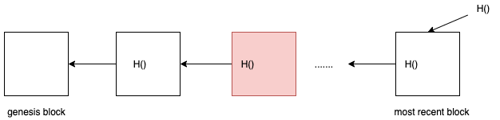
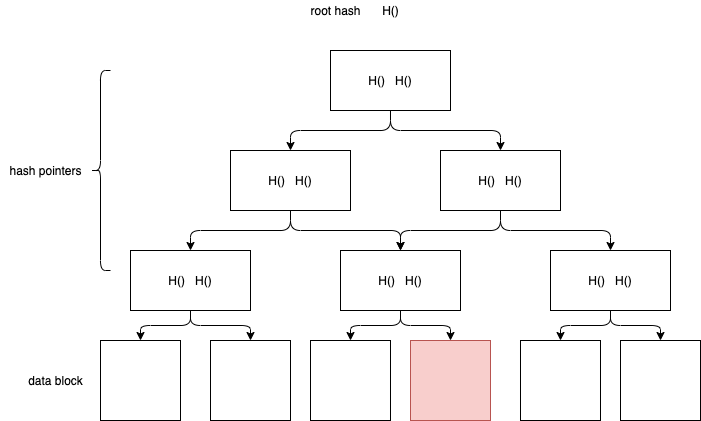
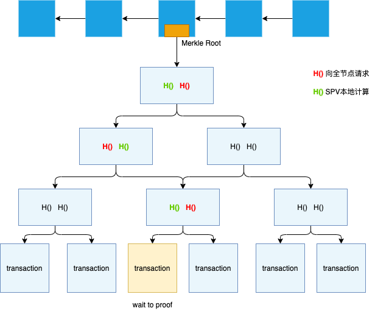

区块链的数据结构
---

Block chain is a linked list using hash pointers.

## 哈希指针（Hash Pointer）

tamper-evident log

牵一发，动全身，引发多米诺骨牌效应

不能有环，哈希指针是有依赖关系的

## 默克尔树（Merkle tree）

Sotrted Merkle Tree

## 比特币的区块结构

轻节点如何验证某个交易在区块中？

轻节点支付确认（SPV-simplified payment verification）

provide a Merkle Proof
Proof of membership
Proof of inclusion

1. 本地算出要验证的 transaction 的哈希值
2. 向全节点请求缺失的哈希值
3. 继续本地算出上一层