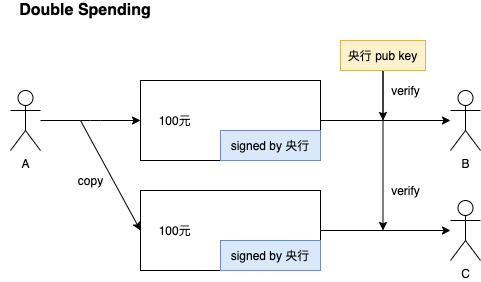
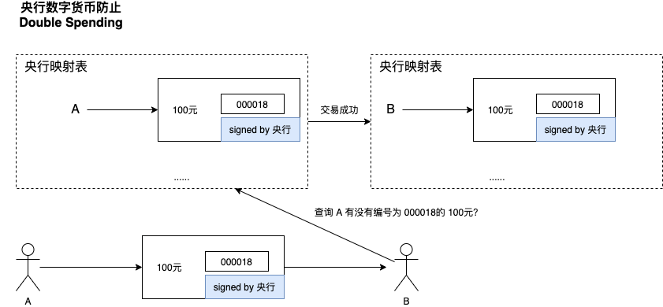
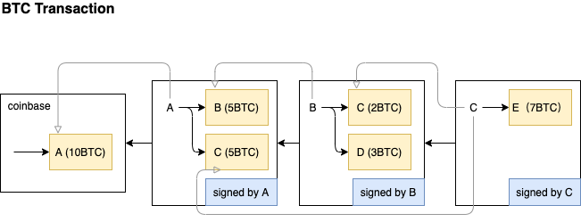

比特币交易协议
---

### 「双花」攻击（Double Spending Attack）

#### 什么是双花攻击？

假设：央行发行了一种数字货币，央行用私钥为货币签名，大家通过央行的公钥对签名验证，如果通过了，就证明货币合法。

这样做，有什么问题？

A 先向 B 转了 100 个央行货币，B 通过央行公钥验证，发现没问题，就收下了钱，这个过程是没问题的。
但是，A 发现数字货币在系统中只是个文件而已，于是他复制了一份，再次把钱转给了 C，C 依然只通过公钥验证，接受了这笔钱。
A 用同一笔 100 元花了两次，就是所谓的「双花」攻击。

「双花」在纸质人民币交易中就不会存在，因为：
1. 人民币有强大的防伪标识，无法伪造复制
2. A 将 100 元给了 B，他就不再拥有那张人民币了

#### 央行数字货币要如何解决「双花」问题？

我们知道，央行是中心化的货币系统，货币发行、交易处理都需要央行去做。那么想防止「双花」也需要央行对数字货币做处理，一种办法是：

为货币增加编号，并记录一个(owner -> 编号)的映射表，具体交易过程如下图

1. 假设央行映射表中记录了：编号为 000018 的 100 元数字货币是属于 A 的
2. A 将 100 元转给了 B
3. B 先对 100 元进行签名认证
4. B 再向银行发起查询请求，确认这 100 元是不是属于 A 的
5. 确认通过后，交易成功，央行会把 000018 的 100 元映射到 B 身上

### 比特币是如何解决「双花」问题的？

