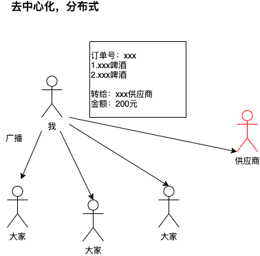
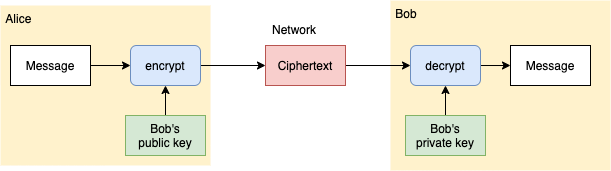
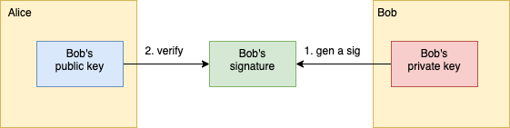

### 一、什么是比特币？

> A purely peer-to-peer version of electronic cash would allow online payments to be sent directly from one party to another without going through a financial institution. 
>
>一个纯正的点对点去中心化的加密数字货币，应能够通过在线支付将币从一方直接发送到另一方，而无需通过任何中心金融机构。

比特币是一种加密货币（crypto-currency），实现基于一个自称中本聪（Satoshi Nakamoto）的不明身份的人所发表的一篇论文（[比特币白皮书](https://btcpapers.com/)）

与其说比特币是货币，不如说比特币是一种基于 P2P 网络的支付结算系统，这样更易于大家理解其本质。

### 二、为什么要发明比特币？

#### 2.1 中心化，基于信任模型

> 酒花 App 平台买了两瓶精酿啤酒
> 一个自称三方供应商的人加我微信，告知我其中一瓶酒没货了，可以加钱换其他的酒
> 虽然这个人微信朋友圈都是精酿啤酒相关的内容，且明确知道我买的哪个酒没货了
> 但是，我内心还是不信任这个人，更信任平台，于是我还是在平台换了一瓶酒

平台就真的值得信任么？
- 假如我下单的时候正好赶上平台服务器宕机，扣款成功了，但没收到货
- 由于平台系统做的不好，再也找不到那笔订单，不能证明我付过钱，也不能给我发货

**比特币要去解决信任问题**

>What is needed is an electronic payment system based on cryptographic proof instead of trust, allowing any two willing parties to transact directly with each other without the need for a trusted third party. 
>
>我们真正需要的是一种基于加密算法密码学原理而非基于信任的数字货币支付系统，不需要可信任第三方参与的情况下，允许双方直接进行支付交易

#### 2.2 双花攻击（Double Spending Attack)

“双花”即同一笔钱花了两次或多次。

现实中使用人民币交易，不存在双花问题

假设央行开发了一套数字货币系统，由于央行不知道数字货币真正属于谁

**比特币要去解决双花问题**

> We propose a solution to the double-spending problem using a peer-to-peer network
> 
>我们将在本文提出一种新方案，使用点对点去中心化网络去解决这个双花问题

在比特币交易的小节中，会详细解释比特币是如何解决双花问题的

### 三、比特币中的密码学

#### 3.1 哈希算法（Hash Algorithm)

* 抗哈希碰撞（Collision resistance）
* 不可逆（Hiding）
* 哈希值不可预测（Puzzle friendly）

#### 3.2 数字签名（Digital Signature）

了解数字签名之前，需要先对非对称加密有一定认识。

##### 3.2.1 什么是非对称加密？

Alice 想通过非对称加密的方式发送一条消息给 Bob，他要怎么做呢？

1. Bob 需要先生成公钥私钥对（public key, private key）
2. Bob 的公钥是对所有人公开的，所以 Alice 可以拿到 Bob's public key
3. Alice 使用 Bob's public key 对 Message 加密，并将密文通过网络传输给 Bob
4. Bob 接收到密文后，使用自己的私钥 Bob's private key 解密，得到了 Message
5. 完成通信

由于 Bob's private key 是保存在 Bob 手里的，只要私钥不泄露，就是安全的。

##### 3.2.2 什么是数字签名？

还是 Alice 想要给 Bob 发送一条消息，并采用非对称加密的方式，Alice 凭什么相信 Bob 的公钥就是 Bob 的呢？有没有可能被其他人调包了呢？这就需要 Alice 用到数字签名的技术，来验证 Bob 的身份是否真实

1. Bob 用私钥生成数字签名
2. Alice 用 Bob 的公钥验证签名
3. 如果验证通过，则证明公钥一定是 Bob 的，因为签名只能由 Bob 的私钥生成

### 四、比特币是如何交易的？

#### 4.1 区块链

区块链，其实不是区块组成的链表，在比特币中是通过 (key,value) 数据库来关联区块的。
- 数据库中，key 是 H（block header)，value 是区块内容。
- 每个 block header 中会存储前一个区块头的哈希值。

#### 4.2 账户

在比特币中，账户就是由本机生成的公私钥对
- 公钥的哈希值用作转账地址，相当于银行卡号
- 私钥相当于银行密码，需要自己妥善保管，一旦丢失是无法找回的

#### 4.3 防止双花

1. coinbase 叫作铸币交易，是挖矿时矿工获得的出块奖励，假设是 A 获得了出块奖励的 10 BTC
2. A 转给了 B 5 BTC，同时转给了 C 5 BTC，这时系统会去验证 A 有没有能力支付 10 BTC，会向前回溯找到 A BTC 的来源，于是找到了铸币交易，发现有 10 BTC，交易合法
3. 同理 C 在转给 E 7BTC 时，需要找到之前交易中得到的 5 + 2 BTC
4. 转账者还需要将交易用自己的私钥签名，用于验证身份

### 五、比特币挖矿

#### 5.1 为什么要挖矿？

工作量证明（Proof of Work）

#### 5.2 挖矿的过程

简单说，通过暴力哈希运算，找到符合要求的随机数 nonce

系统如何知道是哪个矿工先找到的 nonce？

最长合法连

#### 5.3 51%算力攻击

假设有某个组织拥有了全世界 51% 的算力，并且一直在沿着自己的链挖矿，理论上某个时间点，这个组织所挖的链就会变成最长的，广播后，这条链就会成为最长合法链，那么以前的交易就会全部被这个组织替换

### 六、比特币的缺点

1.PoW 造成算力、电力的浪费
2.出块时间限定平均10分钟左右，一笔交易需要大概需要1小时才能得被系统确认
3.比特币私钥丢失之后，是没办法找回的，账户中的比特币永远都取不出来了
4.转账写错地址，无法回滚

### 参考

- [比特币白皮书](https://btcpapers.com/)
- [北京大学肖臻老师的公开课](http://zhenxiao.com/blockchain/)
- 图说区块链
- 图解密码技术